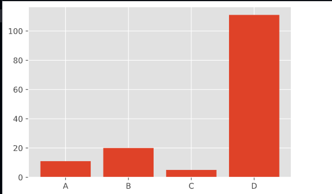
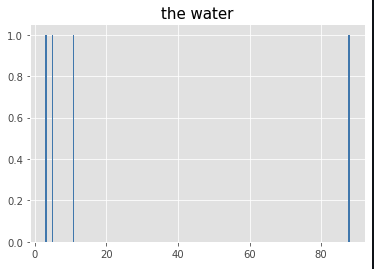
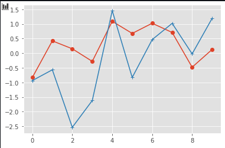
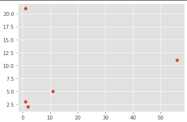

# The use of the matpoltlib
## 1. The bar graph
```python
x = ["A","B","C","D"]
y = [11,20,5,111]
plt.bar(x,y)
```


## 2. The histogram
```python
id_array = [5,11,3,88]
fre_tuple = plt.hist(id_array, bins=200,color='steelblue') # 返回值元组
plt.title("the water", fontproperties='SimHei', fontsize=15)
plt.show()
```
我们要注意的是这里的bins指的是我们将区间分割的个数,所以bins越大得到的数据越细


## 3. The line chart
It may be the simplest way to draw a picture
```python
plt.plot(data1,marker = r'o')
plt.plot(data2,marker = r'+')
plt.show()
```
`marker` 参数指的是这个点的形状,比如o 指的是圆形,x指的是 x形


## 4. The scatter diagram
```python
x = [1,2,56,1,11]
y = [3,2,11,21,5]
plt.scatter(x,y);
```


## 5. The box diagram
uisng the boxplot method in the plt you can get it 

