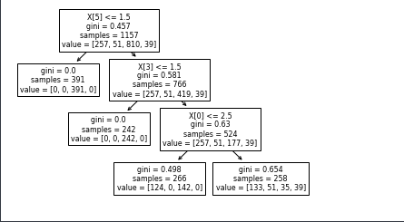

# decision tree using 
## import the needed library
```python
import numpy as np
import pandas as pd
import seaborn as sns
from matplotlib import pyplot as plt
from sklearn.model_selection import train_test_split as tts
import category_encoders as ce 
from sklearn.metrics import accuracy_score
from sklearn import tree
```

## input the data and see the basic situation
```python
data = pd.read_csv("./car_evaluation.csv")
col_names = ['buying', 'maint', 'doors', 'persons', 'lug_boot', 'safety', 'class']
data.columns = col_names
# The primary data do not have the col_name
x_train,x_test,y_train,y_test = tts(x,y,test_size = 0.33,random_state = 42)
# split the data to the train data and the test data
encoder = ce.OrdinalEncoder(x.columns)
# encoding the data feature
x_train = encoder.fit_transform(x_train)
x_test = encoder.fit_transform(x_test)
```

## Uing ID3 and the CATR strategy
### The CART
```python
clf_gini = Dc(criterion='gini',max_depth=3,random_state=0)
clf_gini.fit(x_train,y_train)
y_pred = clf_gini.predict(x_test)
print('Model accuracy score with criterion gini index: {0:0.4f}'. format(accuracy_score(y_test, y_pred)))
```
visiual:`tree.plot_tree(clf_gini.fit(x_train,y_train))`


### The ID3
You just need to change the criterion to the entropy

